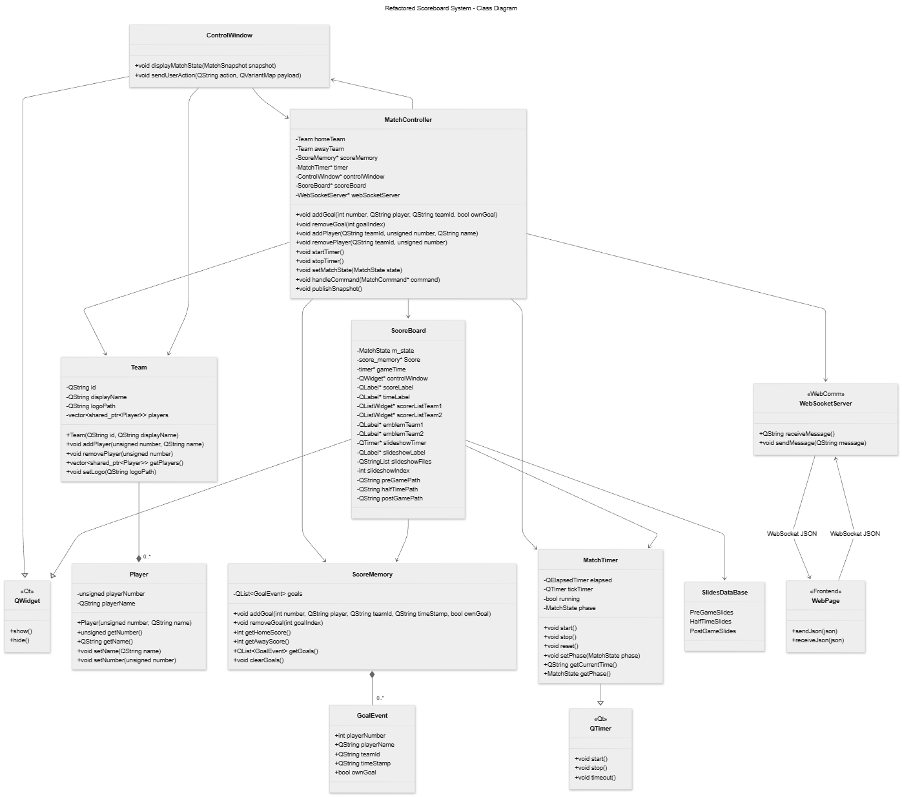

# Anzeigetafel - Football Scoreboard Application

A modular Qt application to manage and display live football match events.

## Branch Status

- Active branch: `CPP_Spinoff_Project`
- Current software version on this branch: **3.0**
- Last major change: MVC refactor to a controller-based architecture

This README is updated to match the current branch structure and code.

## Author

**Paranithan Paramalingam**

Bachelor of Engineering, BFH

Course: BTE5512 - Projektarbeit | BTE5540 - Bachelor Thesis

> This project was developed with assistance from AI tools (ChatGPT/GitHub Copilot) for code generation and documentation.

## Project Overview

The application provides two synchronized windows:

### Control Window


_Operator interface for managing teams, goals, timer, and match state._

### Scoreboard Display


_Fullscreen audience display with score, time, emblems, and goal scorers._

Core runtime behavior:

- Real-time score, goal, and timer updates via Qt signal-slot connections
- Team roster management with CSV import
- Match state workflow: `PreGame -> FirstHalf -> HalfTime -> SecondHalf -> PostGame`
- Slideshow mode for non-live phases (PreGame/HalfTime/PostGame)

## Branch Highlights (Recent)

- **MVC Refactor**: Business logic moved into `match_controller`
- **Unified Team Model**: `home_team`/`away_team` replaced by `team` abstraction
- **Documentation Update**: Extended class and use-case diagrams added

## Architecture (Current Branch)

### Use Case Diagram


_User interactions and system workflows for match operators and audience._

### Data Flow Diagram


_Data flow between external inputs, processing units, data storage, and display outputs._

### System Class Diagram



_Complete class structure showing inheritance, composition, and relationships in the MVC architecture._

### Main Components

- `match_controller` - central business logic and match state management (MVC controller/model layer)
- `controll_window` - operator UI (view layer)
- `Score_board` - public display window with score/timer/goals/slideshow
- `score_memory` - goal events and score state storage
- `timer` - phase-aware match timer logic
- `team` / `player` - roster and player domain model

### Important Runtime Connections

- `controll_window` delegates user actions to `match_controller`
- `match_controller::matchStateChanged` updates scoreboard state (`Score_board::setMatchState`)
- `controll_window::emblemChanged` updates scoreboard emblems (`Score_board::updateEmblem`)
- `score_memory` and `timer` signals update UI labels/lists in both windows

## Build and Run

### Requirements

- Qt 6.6 or newer (Qt Widgets)
- C++17 compatible compiler
- CMake 3.16 or newer
- Windows, Linux, or macOS

### Build with Qt Creator

1. Open `Software/CMakeLists.txt` in Qt Creator
2. Select a Desktop Qt 6 kit
3. Configure, build, and run `anzeigetafel`

### Build with CMake (Command Line)

```bash
cmake -S Software -B Software/build
cmake --build Software/build --config Release
```

Run executable:

- Windows: `Software/build/anzeigetafel.exe`
- Linux/macOS: `Software/build/anzeigetafel`

## Current Project Structure

```text
Anzeigetafel/
|- README.md
|- documentation/
|- Import/
|- slides/
|- LED_wall/
`- Software/
   |- CMakeLists.txt
   |- CMakePresets.json
   |- main.cpp
   |- resources.qrc
   |- include/
   |  |- controll_window.h
   |  |- match_controller.h
   |  |- player.h
   |  |- score_board.h
   |  |- score_memory.h
   |  |- team.h
   |  `- timer.h
   `- src/
      |- controll_window.cpp
      |- match_controller.cpp
      |- player.cpp
      |- score_board.cpp
      |- score_memory.cpp
      |- team.cpp
      `- timer.cpp
```

Note: All UI elements are created programmatically (no `.ui` files).

## Known Limitations

- Fixed for standard 2 x 45 minute football flow
- No extra time, injury time, or penalty shootout mode
- No duplicate jersey-number validation in roster input
- No persistent match-state storage (restart clears runtime state)
- Slideshow directories are expected to exist under `slides/PreGame`, `slides/HalfTime`, and `slides/PostGame`
- `Score_board` currently uses hardcoded slideshow base paths that may need adjustment per deployment target

## Future Enhancements

- Persist match events and results in storage/database
- Configurable match durations and sport presets
- Network output for remote displays/stream overlays
- Exportable event log (CSV/JSON)
- Cross-platform configuration for slide/media paths
