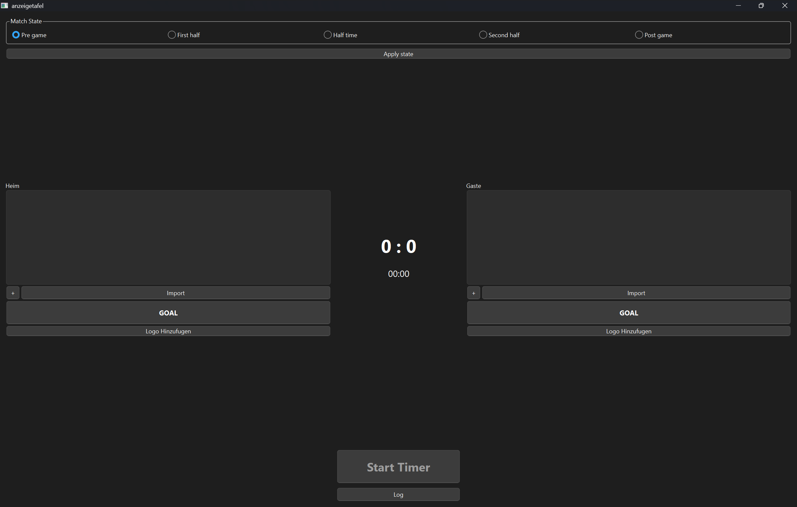
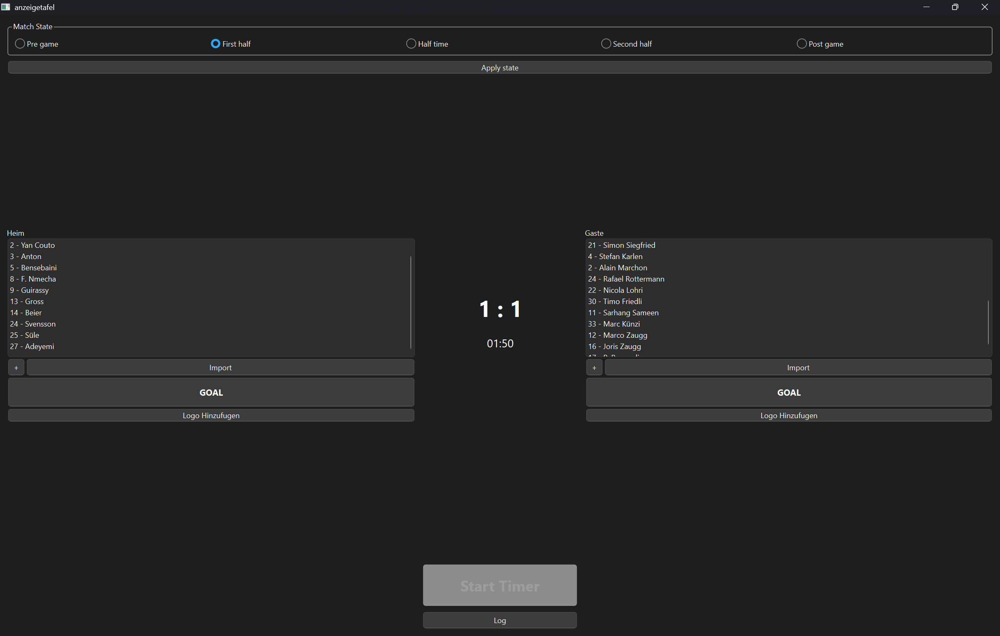
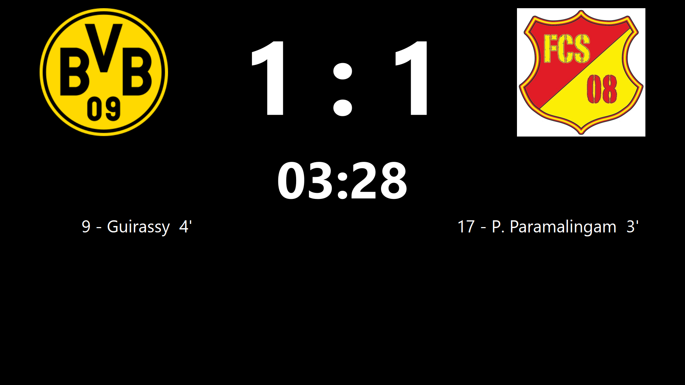
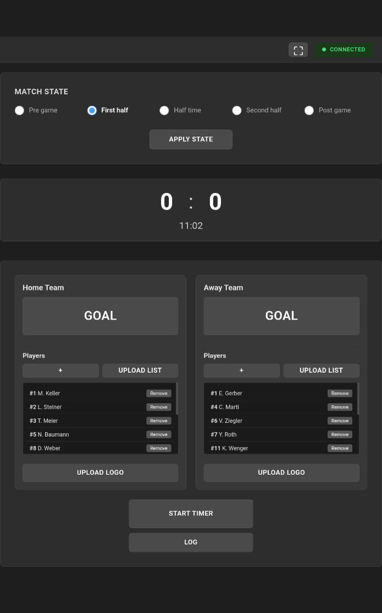
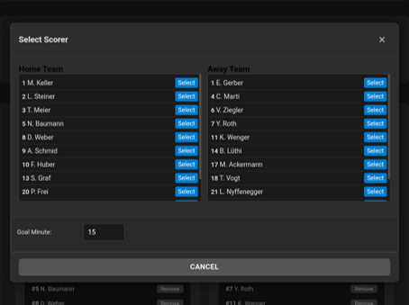
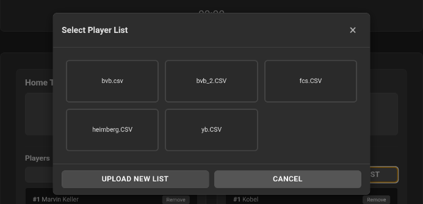
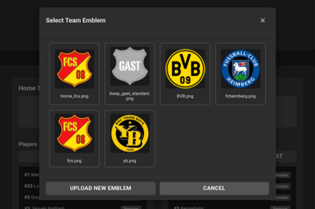
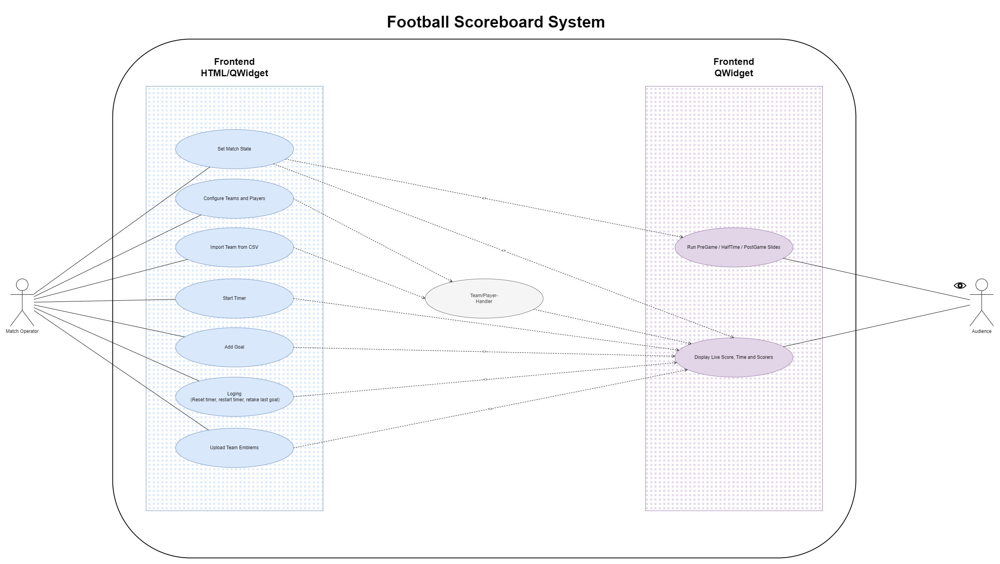
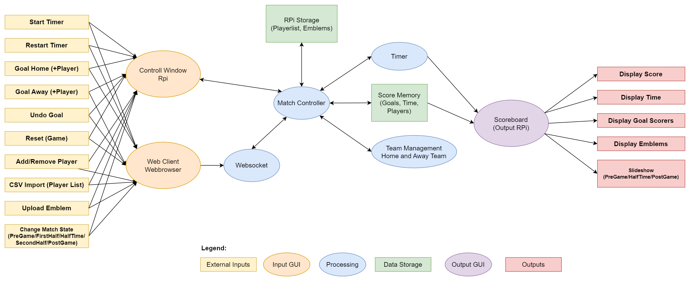
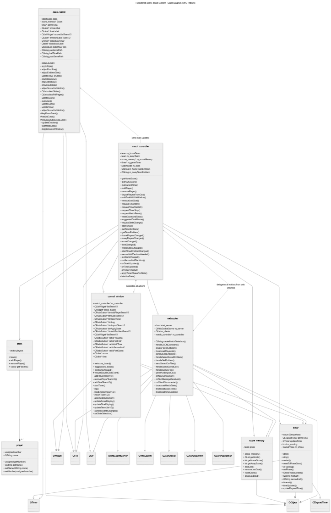

# Anzeigetafel - Football Scoreboard Application

A modular Qt and browser-based application to manage and display live football match events on a scoreboard display.

## Branch Status

- Active branch: `main`
- Current software version: **3.0**
- Last major change: controller-based application structure with WebSocket-controlled web interface

This README is updated to match the current `main` branch structure and code.

## Author

**Paranithan Paramalingam**

Bachelor of Engineering, BFH

Course: BTE5512 - Projektarbeit | BTE5540 - Bachelor Thesis

> This project was developed with assistance from AI tools (ChatGPT/GitHub Copilot) for code generation and documentation.

## Project Overview

The application provides two synchronized Qt windows and one browser-based web interface.

### Control Window





_Operator interface on the Raspberry Pi for managing teams, goals, timer, and match state._

### Scoreboard Display



_Fullscreen audience display with score, time, emblems, and goal scorers._

### Web Interface

The web interface allows the match operator to control the scoreboard from a smartphone, tablet, or computer in the same network. The HTML, CSS, and JavaScript files are served by Apache on the Raspberry Pi. The browser communicates with the Qt application through a WebSocket connection on port `8080`.

The web interface supports:

- connection status display
- fullscreen mode in the browser
- match state selection: `PreGame -> FirstHalf -> HalfTime -> SecondHalf -> PostGame`
- live score and time synchronization
- timer start, restart, score reset, timer reset, and last-goal undo
- player management for home and away team
- CSV player-list upload and selection from saved CSV files
- goal entry with player selection and own-goal confirmation
- emblem upload and selection from saved emblem files

#### Web Interface Screenshot Placeholders









Core runtime behavior:

- Real-time score, goal, and timer updates via Qt signal-slot connections
- WebSocket communication between browser clients and the Qt application
- Team roster management with manual input and CSV import
- Match state workflow: `PreGame -> FirstHalf -> HalfTime -> SecondHalf -> PostGame`
- Slideshow mode for non-live phases: PreGame, HalfTime, and PostGame

## Current Highlights

- **Controller-based match logic**: business logic is centralized in `match_controller`
- **Unified Team Model**: `home_team` and `away_team` were replaced by a reusable `team` abstraction
- **Browser Control**: a web interface can control match state, timer, goals, players, CSV imports, and emblems
- **WebSocket Synchronization**: browser clients receive live state, score, time, and player-list updates
- **Documentation Update**: extended class and use-case diagrams are included in the documentation folder

## Architecture

### Use Case Diagram



_User interactions and system workflows for match operators and audience._

### Data Flow Diagram



_Data flow between external inputs, processing units, data storage, and display outputs._

### System Class Diagram



_Complete class structure showing inheritance, composition, and relationships in the current controller-based architecture._

### Main Components

- `match_controller` - central match logic, match state management, player handling, scoring, timer requests, and emblem updates
- `controll_window` - local operator control window on the Raspberry Pi
- `Score_board` - public display window with score, timer, goals, emblems, and slideshow mode
- `score_memory` - goal events and score state storage
- `timer` - phase-aware match timer logic
- `team` / `player` - roster and player domain model
- `websocket` - WebSocket server for browser-based control
- `webinterface` - HTML/CSS/JavaScript browser interface served by Apache

### Important Runtime Connections

- `controll_window` delegates user actions to `match_controller`
- browser clients send JSON commands to the WebSocket server
- `websocket` forwards browser commands to `match_controller`
- `match_controller::matchStateChanged` updates the scoreboard state through `Score_board::setMatchState`
- `match_controller::emblemChanged` updates scoreboard emblems through `Score_board::updateEmblem`
- `score_memory` and `timer` signals update UI labels, score lists, and browser state

## Build and Run

### Requirements

- Qt 6.6 or newer
- Qt Widgets module
- Qt WebSockets module
- C++17 compatible compiler
- CMake 3.16 or newer
- Ninja build system recommended
- Windows, Linux, macOS, or Raspberry Pi OS

### Build with Qt Creator

1. Open `software/CMakeLists.txt` in Qt Creator
2. Select a Desktop Qt 6 kit
3. Configure, build, and run `anzeigetafel`

### Build with CMake - Command Line

From the repository root:

```bash
cmake -S software -B software/build -G Ninja
cmake --build software/build -j$(nproc)
```

Run executable:

```bash
./software/build/anzeigetafel
```

On Windows, the executable is usually located here after building:

```text
software/build/anzeigetafel.exe
```

## Raspberry Pi Implementation and Configuration

The project is implemented and deployed on a Raspberry Pi. The Raspberry Pi runs the Qt application, outputs the scoreboard image over HDMI, starts the WebSocket server for browser control, and hosts the web interface with Apache.

The following instructions use the Raspberry Pi user `rpi` and the repository path `/home/rpi/Anzeigetafel`. If another username or path is used, update all paths accordingly.

### 1. Install Required Packages

```bash
sudo apt update
sudo apt upgrade
sudo apt install -y build-essential cmake ninja-build git
sudo apt install -y qt6-base-dev qt6-base-dev-tools qt6-websockets-dev qt6-wayland
```

### 2. Clone Repository

```bash
git clone git@github.com:paranithan17/Anzeigetafel.git
cd ~/Anzeigetafel/software
```

### 3. Build Application on Raspberry Pi

```bash
rm -rf build
cmake -S . -B build -G Ninja
cmake --build build -j$(nproc)
```

### 4. Start Application Manually

```bash
/home/rpi/Anzeigetafel/software/build/anzeigetafel
```

Alternative from inside the `software` folder:

```bash
./build/anzeigetafel
```

### 5. Create Desktop Shortcut

Create the shortcut file:

```bash
nano ~/Desktop/Anzeigetafel.desktop
```

Insert the following content:

```ini
[Desktop Entry]
Version=1.0
Type=Application
Name=Anzeigetafel
Comment=Football Scoreboard
Exec=/home/rpi/Anzeigetafel/software/build/anzeigetafel
Path=/home/rpi/Anzeigetafel/software/build
Icon=/home/rpi/Anzeigetafel/software/icons/fcs_256.png
Terminal=false
Categories=Utility;
```

Make the shortcut executable:

```bash
chmod +x ~/Desktop/Anzeigetafel.desktop
```

### 6. Configure Automatic Application Start

Create a systemd service file:

```bash
sudo nano /etc/systemd/system/anzeigetafel.service
```

Insert the following content:

```ini
[Unit]
Description=Anzeigetafel GUI
After=graphical.target
Wants=graphical.target

[Service]
User=rpi
WorkingDirectory=/home/rpi/Anzeigetafel/software
ExecStart=/home/rpi/Anzeigetafel/software/build/anzeigetafel

Environment=DISPLAY=:0
Environment=QT_QPA_PLATFORM=xcb

Restart=on-failure
RestartSec=2

[Install]
WantedBy=graphical.target
```

Activate and start the service:

```bash
sudo systemctl daemon-reload
sudo systemctl enable anzeigetafel.service
sudo systemctl start anzeigetafel.service
sudo systemctl status anzeigetafel.service
```

### 7. Configure Fixed Raspberry Pi IP Address

The web interface and WebSocket client are configured for the Raspberry Pi IP address:

```text
192.168.200.8
```

The Raspberry Pi must therefore keep this IP address. It can be configured manually through the Raspberry Pi network settings. On systems using NetworkManager, the following command-line variant can be used. First list the available connections:

```bash
nmcli con show
```

Then configure the selected connection. Replace `<connection-name>` with the actual connection name, for example `Wired connection 1` or the WLAN connection name.

```bash
sudo nmcli con mod "<connection-name>" ipv4.addresses 192.168.200.8/24 ipv4.method manual
sudo nmcli con down "<connection-name>"
sudo nmcli con up "<connection-name>"
ip addr show
```

If the network requires a gateway and DNS server, configure them as well:

```bash
sudo nmcli con mod "<connection-name>" ipv4.gateway 192.168.200.1
sudo nmcli con mod "<connection-name>" ipv4.dns "192.168.200.1 8.8.8.8"
```

### 8. Install Apache Web Server

Install Apache so the web interface can be opened from another device in the same network:

```bash
sudo apt install apache2 -y
sudo systemctl enable apache2
sudo systemctl start apache2
```

After installation, the Apache default page should be visible in a browser when the Raspberry Pi IP address is entered.

Default Apache web directory:

```text
/var/www/html
```

For this project, Apache is configured to serve the repository folder `webinterface` directly. This avoids manually copying HTML, CSS, and JavaScript files after every repository update.

### 9. Configure Apache Document Root for the Web Interface

Open the Apache default site configuration:

```bash
sudo nano /etc/apache2/sites-available/000-default.conf
```

Use the following configuration:

```apache
<VirtualHost *:80>
    ServerAdmin webmaster@localhost
    DocumentRoot /home/rpi/Anzeigetafel/webinterface

    <Directory /home/rpi/Anzeigetafel/webinterface>
        Options Indexes FollowSymLinks
        AllowOverride None
        Require all granted
    </Directory>

    ErrorLog ${APACHE_LOG_DIR}/error.log
    CustomLog ${APACHE_LOG_DIR}/access.log combined
</VirtualHost>
```

Make sure the relevant directories are accessible for Apache:

```bash
sudo chmod 755 /home/rpi
sudo chmod 755 /home/rpi/Anzeigetafel
sudo chmod 755 /home/rpi/Anzeigetafel/webinterface
```

Check the Apache configuration and reload the service:

```bash
sudo apache2ctl configtest
sudo systemctl reload apache2
```

The web interface should now be available in the browser at:

```text
http://192.168.200.8/
```

The browser interface connects to the Qt application through:

```text
ws://192.168.200.8:8080
```

For the web interface to work, the Qt application must be running and the WebSocket server must have started successfully.

## Current Project Structure

```text
Anzeigetafel/
|- README.md
|- documentation/
|- Import/
|- slides/
|- LED_wall/
|- webinterface/
|  |- index.html
|  |- styles.css
|  |- modal-styles.css
|  |- application.js
|  |- websocket.js
|  |- matchstate.js
|  |- goal-management.js
|  |- player-management.js
|  |- emblem-management.js
|  |- log-modal.js
|  `- timer.js
`- software/
   |- CMakeLists.txt
   |- CMakePresets.json
   |- main.cpp
   |- resources.qrc
   |- include/
   |  |- controll_window.h
   |  |- match_controller.h
   |  |- player.h
   |  |- score_board.h
   |  |- score_memory.h
   |  |- team.h
   |  |- timer.h
   |  `- web_server.h
   `- src/
      |- controll_window.cpp
      |- match_controller.cpp
      |- player.cpp
      |- score_board.cpp
      |- score_memory.cpp
      |- team.cpp
      |- timer.cpp
      `- web_server.cpp
```

Note: The Qt UI elements are created programmatically. The browser interface is implemented separately with HTML, CSS, and JavaScript.

## Known Limitations

- Fixed for standard 2 x 45 minute football flow
- No extra time, injury time, or penalty shootout mode
- No duplicate jersey-number validation in roster input
- No persistent match-state storage; restarting the application clears runtime state
- Slideshow directories are expected to exist under `slides/PreGame`, `slides/HalfTime`, and `slides/PostGame`
- `Score_board` currently uses hardcoded slideshow base paths that may need adjustment per deployment target
- WebSocket IP address is currently configured for `192.168.200.8`
- Apache configuration assumes the repository path `/home/rpi/Anzeigetafel/webinterface`
- The web interface has no authentication and should only be used in a trusted local network

## Future Enhancements

- Configurable match durations and sport presets
- Authentication or access protection for the web interface
- Cross-platform configuration for slide and media paths
- Import slides over the web interface
